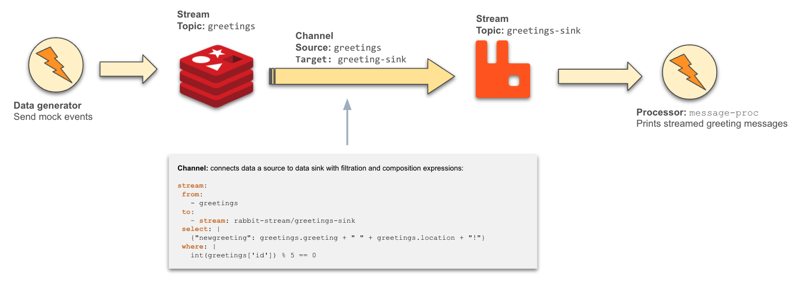

# Distributed Streaming Runtime 
This is a proof of concept that shows how to build a stream processing runtime
using [CNCF](https://landscape.cncf.io/card-mode?project=graduated,incubating) open source projects.

## Features

* Built on top of solid CNCF projects 
* Provides easy abstractions to create stream processing apps
* Integrates with several popular streaming platforms

## Examples
The project comes with several examples that showcase its 
components and how they work. 

> See [all examples](./examples)!

### Using the Channel component 

The project comes with several components that allows users to
compose distributed stream processing applications.
This example demonstrates the use of the `Channel` component to
stream data from a streaming source (Redis Streams) to another
stream topic (on RabbitMQ). The channel uses Common Expression language
to specify data filtration and composition as illustrated below.



The YAML for the Channel component is shown below. It makes it 
easy to declare the source and sink for the streaming data along
with its behavior as the data is streamed.

```yaml
apiVersion: streaming.vivien.io/v1alpha1
kind: Channel
metadata:
  name: greetings-channel
  namespace: default
spec:
  servicePort: 8080
  stream:
    from:
      - greetings
    to:
      - stream: rabbit-stream/greetings-sink
    select: |
      {"newgreeting": greetings.greeting + " " + greetings.location + "!"}
    where: |
      int(greetings['id']) % 5 == 0
```