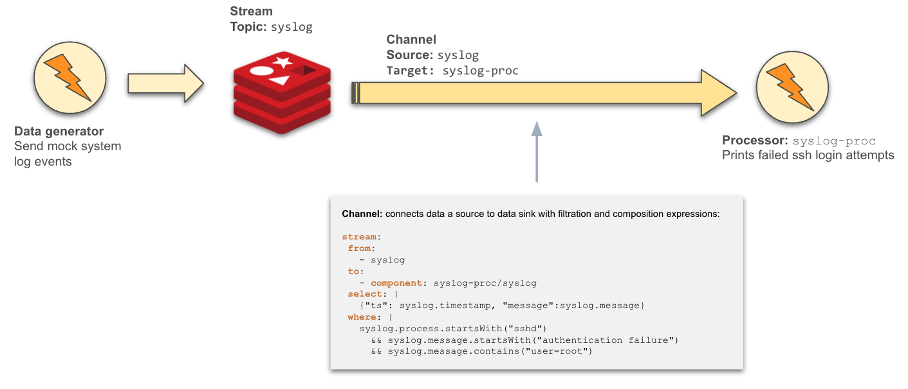

# Detect SSH login attacks

This example demonstrates the use of the `Channel` component to stream (mocked) system log events to detect failed ssh login attempts by root.
This example is inspired by [SSH-attack](https://developer.confluent.io/tutorials/SSH-attack/confluent.html) example from
Confluent (however, for simplicity sake, it streams from Redis instead of Kafka).

## Components
This example uses several [streaming-runtime components](./manifests) as shown in the illustration below.



## Pre-requisites

Before you can run this example, you must have the following *pre-requisites*:

* Your cluster has the `dapr` runtime components deployed
* Your cluster also needs to have the `streaming-runtime-go` components deployed
* Deploy a Redis cluster (this example deploys a one-node cluster for this demonstration)

## Install and run

For this simple example, the following steps will install the components necessary.

### Install Dapr

This implementation of the Streaming-Runtime project uses Dapr and its API. You must install the Dapr components on your cluster prior
to running the example. Install the [Dapr CLI](https://docs.dapr.io/getting-started/install-dapr-cli/) and run the following
command to install the Dapr components on the Kubernetes cluster

```
dapr init -k
```

> See instructions on [installing Dapr components](https://docs.dapr.io/operations/hosting/kubernetes/kubernetes-deploy/)

### Install the Streaming-Runtime controllers

You will need to install the Streaming-Runtime controller components before you can start.  This is done by simply
running the following `kubectl` command:

```
kubectl apply -f https://raw.githubusercontent.com/vladimirvivien/streaming-runtime-go/main/config/streaming-components.yaml
```

### Running the example

At this point, you are ready to run the example components.

#### Deploy the components

The following command will deploy all components to run the example on the cluster:

```
kubectl apply -f https://raw.githubusercontent.com/vladimirvivien/streaming-runtime-go/main/examples/detect-ssh-attack/manifests-all.yaml
```

> NOTE: While this example uses Redis Streams, you can use any of your favorite brokers including Kafka, RabbitMQ, NATS, etc., [supported by Dapr](https://docs.dapr.io/reference/components-reference/supported-pubsub/)
for streaming.

#### Validate deployment

Validate that the expected components are deployed and are running OK.
First, get a list of running pods in the `default` namespace:

```
kubectl get pods
NAME                              READY   STATUS    RESTARTS      AGE
redis-6cc59df87c-rvbt8            1/1     Running   0             28s
syslog-channel-7989cc45b6-hcncp   2/2     Running   1 (25s ago)   28s
syslog-gen-854f48c84b-m5g8k       2/2     Running   1 (24s ago)   28s
syslog-proc-779fb45cb5-6jrqg      2/2     Running   0             28s
```

If everything is working OK, you should be able to see ssh login attempts messages printed to standard output
in the `syslog-proc` component:

```
kubectl logs -l app=syslog-proc -c syslog-proc
2022/04/07 15:27:58 Data received: {"message":"authentication failure; logname= uid=0 euid=0 tty=NODEVssh ruser= rhost=n219076184117.netvigator.com  user=root", "ts":"Jun 22 03:17:26"}
2022/04/07 15:27:59 Data received: {"message":"authentication failure; logname= uid=0 euid=0 tty=NODEVssh ruser= rhost=n219076184117.netvigator.com  user=root", "ts":"Jun 22 03:17:26"}
2022/04/07 15:28:00 Data received: {"message":"authentication failure; logname= uid=0 euid=0 tty=NODEVssh ruser= rhost=n219076184117.netvigator.com  user=root", "ts":"Jun 22 03:17:35"}
2022/04/07 15:28:01 Data received: {"message":"authentication failure; logname= uid=0 euid=0 tty=NODEVssh ruser= rhost=n219076184117.netvigator.com  user=root", "ts":"Jun 22 03:17:36"}
```

## Artifacts manifest

### Redis Streams deployment
This example uses Redis Streams to receive and stream system log events before they are processed. See [redis.yaml](./manifests/redis.yaml).

> The following YAML deploys a single-pod instance of Redis stream for simplicity. You can use an operator or
> a Helm chart for a more sophisticated installation.

```yaml
apiVersion: apps/v1
kind: Deployment
metadata:
  name: redis
  namespace: default
spec:
  selector:
    matchLabels:
      app: redis
  replicas: 1
  template:
    metadata:
      labels:
        app: redis
    spec:
      containers:
        - name: redis
          image: redis:6.2.6-alpine
```

### Redis `ClusterStream`
This `ClusterStream` component configures the connection to Redis Streams as a pub/sub broker. See [redis.yaml](./manifests/redis.yaml).

> Note that this component expects the broker to be deployed and accessible ahead of time.

```yaml
apiVersion: streaming.vivien.io/v1alpha1
kind: ClusterStream
metadata:
  name: syslog-stream
  namespace: default
spec:
  protocol: redis
  properties:
    redisHost: redis:6379
    redisPassword: ""
```

### Redis `Stream`
This `Stream` component defines (and creates, if possible) a stream topic where syslog events will be streamed from.
See [stream.yaml](./manifests/stream.yaml).

```yaml
apiVersion: streaming.vivien.io/v1alpha1
kind: Stream
metadata:
  name: greetings
  namespace: default
spec:
  clusterStream: "syslog-stream"
  topic: "syslog"
  route: "/syslog"
  recipients:
    - syslog-channel
```

> Note that the `syslog` Stream component targets the `syslog-channel` Channel component as its recipient (see below).

### The `Channel` component

The `Channel` component does the followings:

* Streams system events from the `syslog/syslog` topic (Redis Streams)
* Applies data filtering and data construction expressions
* Routes and stream the resulting selected events to the `syslog-proc` Processor component

See [syslog-chan.yaml](./manifests/syslog-chan.yaml).

```yaml
apiVersion: streaming.vivien.io/v1alpha1
kind: Channel
metadata:
  name: syslog-channel
  namespace: default
spec:
  servicePort: 8080
  serviceRoute: syslog
  select:
    data: |
      {"ts": syslog.timestamp, "message":syslog.message}
    where: |
      syslog.process.startsWith("sshd")
        && syslog.message.startsWith("authentication failure")
        && syslog.message.contains("user=root")
  target:
    component: syslog-proc/syslog
```

### The message `Processor`
Component `syslog-proc` deploys a simple [Go application](../message-proc) that logs (to standard output) the system events that
are streamed from the Channel component (above).

See [message-proc](./manifests/syslog-proc.yaml).

```yaml
apiVersion: streaming.vivien.io/v1alpha1
kind: Processor
metadata:
  name: syslog-proc
  namespace: default
spec:
  replicas: 1
  servicePort: 8080
  serviceRoute: syslog
  container:
    name: syslog-proc
    image: ghcr.io/vladimirvivien/streaming-runtime-examples/message-proc:latest
    imagePullPolicy: Always
```

### Syslog generator
Lastly, the `syslog-gen` application is a simple [Go an application](../message-gen) that generates mock system messages
that are sent to Redis Streams. See [message-gen.yaml](./manifests/syslog-gen.yaml).

```yaml
apiVersion: apps/v1
kind: Deployment
metadata:
  name: syslog-gen
spec:
  replicas: 1
  template:
    metadata:
      annotations:
        dapr.io/enabled: "true"
        dapr.io/app-id: "syslog-gen"
    spec:
      containers:
        - name: syslog-gen
          image: ghcr.io/vladimirvivien/streaming-runtime-examples/message-gen:latest
          imagePullPolicy: Always
          env:
            - name: MESSAGE_EXPR # required: expression to generate messages
              value: |
                [
                  {"timestamp":"Jun 14 15:16:01", "process":"sshd(pam_unix)[19939]", "message":"authentication failure; logname= uid=0 euid=0 tty=NODEVssh ruser= rhost=218.188.2.4 "},
                  {"timestamp":"Jun 14 15:16:02", "process":"sshd(pam_unix)[19937]", "message":"check pass; user unknown"},
                  {"timestamp":"Jun 14 15:16:02", "process":"sshd(pam_unix)[19937]", "message":"authentication failure; logname= uid=0 euid=0 tty=NODEVssh ruser= rhost=218.188.2.4 "},
                  {"timestamp":"Jun 15 02:04:59", "process":"sshd(pam_unix)[20885]", "message":"authentication failure; logname= uid=0 euid=0 tty=NODEVssh ruser= rhost=220-135-151-1.hinet-ip.hinet.net  user=root"},
                  {"timestamp":"Jun 15 04:06:18", "process":"su(pam_unix)[21416]", "message":"session opened for user cyrus by (uid=0)"},
                  {"timestamp":"Jun 15 04:06:19", "process":"su(pam_unix)[21416]", "message":"session closed for user cyrus"},
                ...
                 ]
            - name: CLUSTER_STREAM
              value: "syslog-stream"
            - name: STREAM_TOPIC
              value: "syslog"
```

