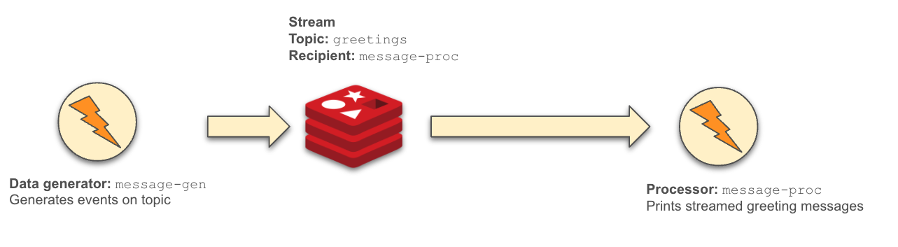

# Hello Streaming (getting started)

This example shows how to get started with the `streaming-runtime-go` project by deploying a simple application:

* It streams messages from a Redis Streams topic, `greetings`
* Streamed events are forwarded to a Processor component
* The component, a [Go application](../message-proc) in this example, simply prints the received messages Processor

## Components
This example uses several [streaming-runtime components](../../components) as shown in the illustration below.



## Pre-requisites

Before you can run the example, you must have the following *pre-requisites*:

* Your cluster has the `dapr` runtime components deployed
* Your cluster also needs to have the `streaming-runtime-go` components
* A streaming broker/provider (this example uses Redis Stream)

## Install and run

For this simple example, the following steps will install the components necessary to generate and stream events.

### Install Dapr

This implementation of the Streaming-Runtime project uses Dapr and its API. You must install the Dapr components on your cluster prior
to running the example. Install the [Dapr CLI](https://docs.dapr.io/getting-started/install-dapr-cli/) and run the following
command to install the Dapr components on the Kubernetes cluster

```
dapr init -k
```

> See instructions on [installing Dapr components](https://docs.dapr.io/operations/hosting/kubernetes/kubernetes-deploy/)

### Install the Streaming-Runtime controllers

You will need to install the Streaming-Runtime controller components before you can start.  This is done by simply
running the following `kubectl` command:

```
kubectl apply -f https://raw.githubusercontent.com/vladimirvivien/streaming-runtime-go/main/config/streaming-components.yaml
```

## Running the example
At this point, you are ready to run the example components.

### Deploy the components

The following command will deploy all components to run the example on the cluster:

```
kubectl apply -f https://github.com/vladimirvivien/streaming-runtime-go/blob/main/examples/hello-streaming/manifests
```

> NOTE: While this example uses Redis Streams, you can use any of your favorite brokers, including Kafka, Rabbit, NATS, etc., [supported by Dapr](https://docs.dapr.io/reference/components-reference/supported-pubsub/)
for streaming.

### Validate deployment
Validate that the expected components are deployed and are running OK.
First, get a list of running pods in the `default` namespace:

```
kubectl get pods
NAME                            READY   STATUS    RESTARTS      AGE
message-gen-696747d4f4-kzxsc    2/2     Running   1 (48m ago)   48m
message-proc-796f5db478-tk9np   2/2     Running   0             48m
redis-6cc59df87c-kw6ll          1/1     Running   0             48m
```

If everything is working OK, you should be able to see messages printed to standard output
in the `message-proc` component:

```
kubectl logs -l app=message-proc -c message-proc
2022/03/03 17:22:33 /messages invoked: [content-type: application/cloudevents+json, url: ?, data: {"traceid":"00-68a56b48c90ba65167036da7ab0f6a9d-4dc61f63ce5fbea5-00","data":{"message":{"id":440,"text":"time is 2022-03-03 17:22:33.053691534 +0000 UTC m=+3075.855265688"}},"specversion":"1.0","datacontenttype":"application/json","source":"message-gen","pubsubname":"redis-stream","tracestate":"","id":"04a5586b-72de-4c3c-ba2f-922e1147a00f","type":"com.dapr.event.sent","topic":"hello-topic-stream"}
```

## Artifacts manifest

### Redis streaming
For simplicity, this example uses Redis Streams as a pub/sub broker to stream events. The following YAML deploys a
single-pod Redis server for your convenience. You can also use a Helm chart for a more sophisticated setup.

See [redis.yaml](./manifests/redis.yaml).

```yaml
apiVersion: apps/v1
kind: Deployment
metadata:
  name: redis
  namespace: default
spec:
  selector:
    matchLabels:
      app: redis
  replicas: 1
  template:
    metadata:
      labels:
        app: redis
    spec:
      containers:
        - name: redis
          image: redis:6.2.6-alpine
```

### Redis `ClusterStream`
This `ClusterStream` component configures the connection to the Redis Streams pub/sub broker. See [redis.yaml](./manifests/redis.yaml).

> Note that this component expects the broker to be already deployed and accessible ahead of time.

```yaml
apiVersion: streaming.vivien.io/v1alpha1
kind: ClusterStream
metadata:
  name: redis-stream
  namespace: default
spec:
  protocol: redis
  properties:
    redisHost: redis:6379
    redisPassword: ""
```

### Redis `Stream` 
This `Stream` component defines (and creates, if possible) a stream topic where events will be sent. 
Note that the stream component can specify a recipient (`message-proc`, defined later) that will receive the messages. 

See [stream.yaml](./manifests/stream.yaml).

```yaml
apiVersion: streaming.vivien.io/v1alpha1
kind: Stream
metadata:
  name: hello-topic-stream
  namespace: default
spec:
  clusterStream: "redis-stream"
  topic: "hello-topic-stream"
  route: "/messages"
  recipients:
    - message-proc
```

### The message `Processor`

Component `message-proc` is a [Processor](../../docs/processor-component.md) component that deploys a [Go application](../message-proc) that
uses the [Dapr Go API](https://docs.dapr.io/developing-applications/sdks/go/) to receive and process streamed events. In this example, the
processor simply prints the events to standard output.

See [message-proc](./manifests/message-proc.yaml).

```yaml
apiVersion: streaming.vivien.io/v1alpha1
kind: Processor
metadata:
  name: message-proc
  namespace: default
spec:
  replicas: 1
  servicePort: 8080
  container:
    name: message-proc
    image: ghcr.io/vladimirvivien/streaming-runtime-examples/hello-streaming/message-proc:latest
    imagePullPolicy: Always
```

### Message generator
Lastly, the `message-gen` application is a simple [Go an application](../message-gen), that uses the Dapr API, to generate mock event messages 
that are sent to the defined topic. 

See [message-gen.yaml](./manifests/message-gen.yaml).

```yaml
apiVersion: apps/v1
kind: Deployment
metadata:
  name: message-gen
spec:
  replicas: 1
  selector:
    matchLabels:
      app: message-gen
  template:
    spec:
      containers:
        - name: message-gen
          image: ghcr.io/vladimirvivien/streaming-runtime-examples/message-gen:latest
          imagePullPolicy: Always
          env:
            - name: MESSAGE_EXPR # required: CEL expression for message
              value: '{"id": id, "greeting":"hello", "location":"world", "timestamp":timestamp}'
            - name: CLUSTER_STREAM
              value: "redis-stream"
            - name: STREAM_TOPIC
              value: "hello-topic-stream"
```

